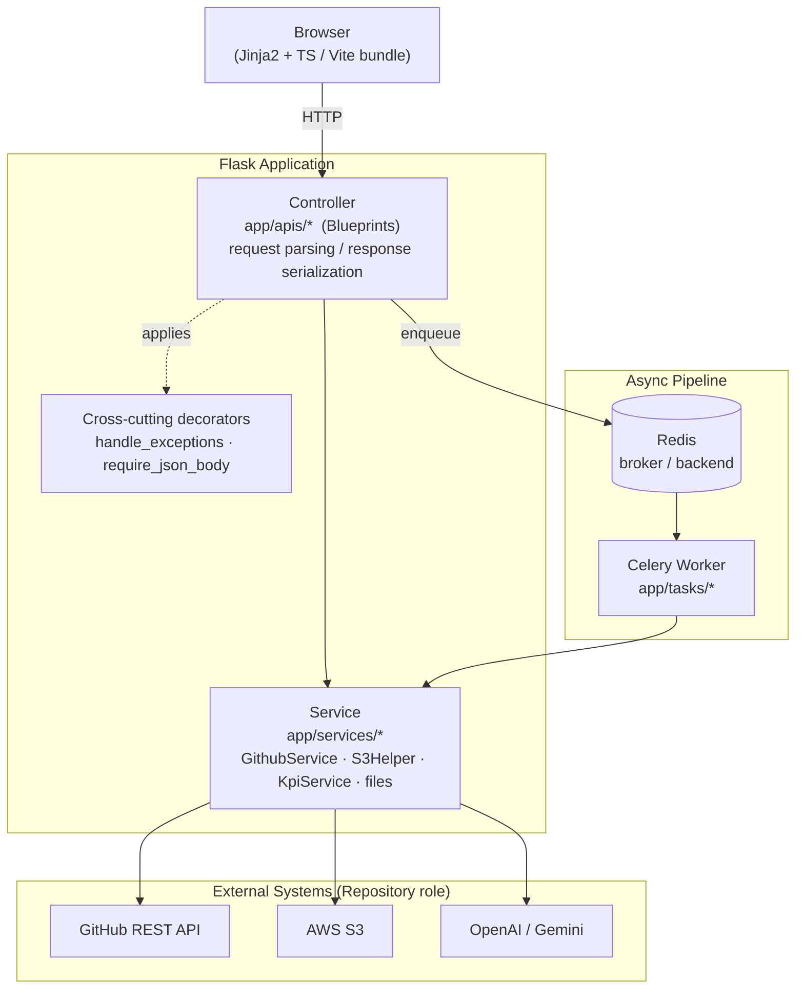
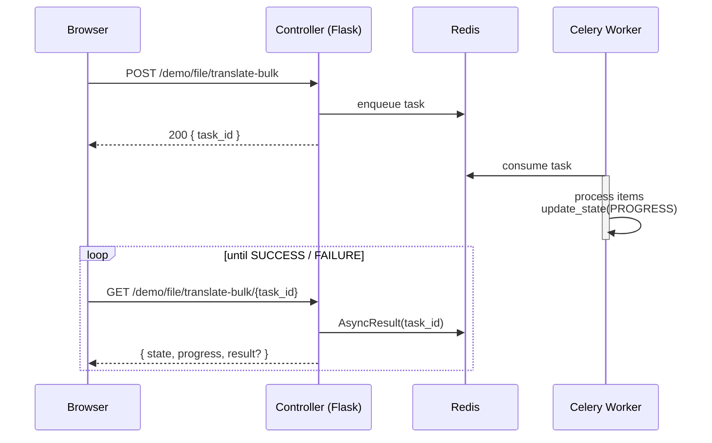

# Localization Demo

A toolbox web app that supports translation / localization workflows.
It runs on Flask and provides utilities for JSON work-file processing,
GitHub-repository-based progress aggregation (KPI), S3 uploads, and LLM calls.

> This repository is a cleaned-up version prepared for portfolio / review.
> All real credentials, keys, internal identifiers, and personal data have been
> removed; every secret is injected exclusively through environment variables.

---

## Tech Stack

### Backend
- **Language / Runtime**: Python 3.12, gunicorn (eventlet worker)
- **Web Framework**: Flask 3 (Blueprint-based routing)
- **Validation / Serialization**: Pydantic (standard response & error models)
- **Async Tasks**: Celery 5 + Redis (broker & result backend)
- **Templating**: Jinja2 (server-side rendering)

### Frontend
- **Language**: TypeScript
- **Bundler**: Vite
- **Styling**: TailwindCSS
- **UI**: SweetAlert2 dialogs, Jinja2-rendered pages with progressive enhancement

### External Integrations
- **GitHub REST API** — repository content, commits, git trees
- **AWS S3** (boto3) — artifact upload / cleanup
- **OpenAI / Gemini** (via LangChain) — translation & LLM playground

### Infrastructure
- **Redis** — Celery broker / result backend
- **Docker Compose** — app + Redis for local one-command bring-up

---

## Architecture

A thin-controller, service-oriented layout. The persistence layer is **not** an
RDBMS — instead, external systems (GitHub / S3 / LLM) act as the data sources,
and dedicated service classes encapsulate access to them (the "Repository" role).



**Layer responsibilities**

| Layer | Location | Responsibility |
|-------|----------|----------------|
| Controller | `app/apis/*` | Parse the request, call a service, serialize a standard response. Kept thin. |
| Service | `app/services/*` | Business logic & orchestration of external systems. Single-responsibility classes. |
| Integration | GitHub / S3 / LLM | External data sources; encapsulated behind service classes. |
| Cross-cutting | `app/utils/etc.py` | Exception handling & input validation via decorators. |
| Schemas | `app/schemas/*` | Pydantic response wrapper & `ErrorCode` enum. |
| Exceptions | `app/exceptions.py` | `AppError` hierarchy mapped to error codes by the controller decorator. |

---

## Async Processing

Long-running work (e.g. bulk translation) is offloaded to Celery so the request
thread is never blocked. The controller enqueues a task, returns a `task_id`
immediately, and the client polls a status endpoint for progress.



- Task definitions live in `app/tasks/*` and are wired through the
  `celery_app` factory, which binds Flask's app context into each task.
- Progress is reported via Celery's `update_state` and surfaced through a
  dedicated status route.

---

## Project Structure

```
app/
├── apis/         # Controller layer (Blueprints)
│   ├── auth.py       # Demo login (env-based single account)
│   ├── common.py     # Misc endpoints
│   ├── external.py   # GitHub / S3 / LLM integration endpoints
│   ├── files.py      # File conversion / extraction endpoints
│   └── page.py       # Template rendering
├── services/     # Service layer
│   ├── github.py     # GithubService — content, commits, trees
│   ├── aws.py        # S3Helper — upload / delete
│   ├── kpi.py        # KpiService — review data → KPI aggregation
│   └── files.py      # File-processing domain logic
├── schemas/      # Response / error models (Pydantic)
│   ├── response.py   # Standard response wrapper
│   └── error.py      # ErrorCode enum
├── exceptions.py # Application exception hierarchy (AppError)
├── utils/        # Decorators, LLM / file helpers
├── tasks/        # Celery tasks
├── data/         # Prompts / static JSON
├── templates/    # Jinja2
└── static/       # TS source + Vite build output
celery_app/       # Celery app factory
config.py         # Environment-specific config
run.py            # Entrypoint / top-level routes
```

---

## Design Notes

- **Thin controllers, logic in services** — e.g. KPI aggregation (review-JSON
  parsing, commit comparison, row building) lives in `KpiService`, not in the
  controller.
- **Standardized responses** — every response is wrapped by `Response`
  (Pydantic) as `{ status_code, data, error, meta }`; user-facing messages are
  centralized in the `ErrorCode` enum.
- **Exception hierarchy** — predictable domain failures subclass `AppError`
  (`PromptNotFoundError`, `DataNotFoundError`, …). The `handle_exceptions`
  decorator converts `AppError` to its `ErrorCode` and anything else to
  `INTERNAL_SERVER_ERROR`, clearly separating expected vs. unexpected failures.
- **Config / secret isolation** — all secrets come from environment variables
  (`.env.example`); `Config` / `DevelopmentConfig` split environment settings.

---

## Security

- **No hardcoded credentials** — the demo login account is injected via
  `AUTH_USERNAME` / `AUTH_PASSWORD`, compared with `hmac.compare_digest` to
  avoid timing attacks.
- **Session key** — `SECRET_KEY` is taken from the environment; if unset, a
  temporary key is generated with a warning (must be pinned in production).
- **CORS** — only origins listed in `CORS_ORIGINS` are allowed (same-origin by
  default).
- **Auth guard** — `before_request` redirects unauthenticated requests to login.
- **Keyword masking** — words in `SECURITY_KEYWORDS` are redacted before being
  sent to an LLM.
- Secrets are never logged.

---

## Getting Started

### Prerequisites

```bash
cp .env.example .env   # fill in SECRET_KEY, AUTH_*, GITHUB_TOKEN, etc.
```

### Local (Python)

```bash
python -m venv venv && source venv/bin/activate
pip install -r requirements.txt

# Redis is required (Celery broker / backend)

# Web server
sh run.sh                      # gunicorn (eventlet)
# or, dev server
python run.py

# Celery worker (separate terminal)
celery -A celery_app.worker worker --loglevel=info
```

### Docker Compose

```bash
docker compose up --build      # app + Redis
```

The default entry path is `/demo/`; unauthenticated requests are redirected to
`/demo/auth/login`.

### Frontend Build (when editing static assets)

```bash
npm install
npm run build                  # vite build
# or watch mode
npm run watch
```
